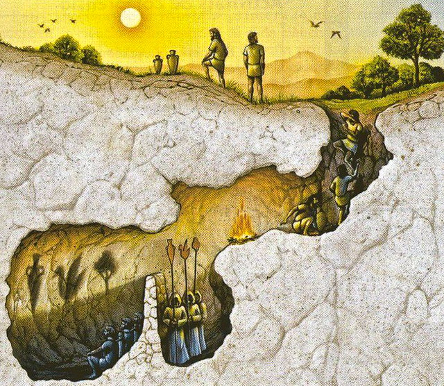

Modern society has perfected idolatry. We’ve traded golden calves for glowing screens, temples for shopping malls, and prophets for influencers. The religion of today isn’t hidden—it’s marketed. It’s sold in hashtags, celebrated in stadiums, and worshipped in algorithms. Yet, most fail to see it for what it is: a hollow cycle of devotion to the transient and trivial.

We’ve replaced gods with brands, saints with celebrities, and meaning with consumption. In doing so, we’ve constructed a culture that thrives not on creation, growth, or transcendence, but on envy, mimicry, and insatiable hunger. At the heart of it all lies a question that too few dare to ask: **What are we worshipping?**

---

## **The Market: Our Omnipresent Deity**

The market has become our god. It’s omnipresent, omniscient, and omnipotent, shaping every aspect of our lives. It demands worship, exacts sacrifices, and provides the illusion of salvation.

### **Omnipresence**
The market is everywhere. It’s in your pocket, your home, your workplace, your entertainment, your relationships. There’s no space untouched by its reach. Every interaction, every moment of leisure, every fleeting thought is a potential transaction waiting to happen. The market is the air we breathe; it permeates our consciousness, molding our desires and dictating our priorities.

### **Omniscience**
The market knows everything. It sees your search history, tracks your spending habits, and predicts your cravings before you even recognize them. Algorithms—the priests of this omniscient god—translate your desires into actionable data, ensuring that the market’s divine will is fulfilled. Nothing is private. Nothing is sacred. Your very thoughts are commodities to be harvested and sold.

### **Omnipotence**
The market decides what has value. It chooses who thrives and who starves. It creates wealth from nothing and reduces lives to numbers on a spreadsheet. Its power is absolute, and its influence is inescapable. Governments bow to it. Entire ecosystems are sacrificed for it. The market is not just powerful—it is the ultimate arbiter of human existence.

### **Worship and Ritual**
The worship of the market is not passive. It demands active participation. Black Friday, Cyber Monday, Prime Day—these are its high holy days. Consumers gather in its digital temples, offering their money in exchange for fleeting blessings. Every purchase, every swipe of a credit card, every click of “Add to Cart” is a ritual act of devotion.

---

## **Celebrity: The Saints of the Secular Church**

If the market is our god, then celebrities are its saints, canonized through fame and enshrined in the collective consciousness. They embody the values of this new religion: materialism, hypersexualization, despair, and apathy.

### **The Iconography of Celebrity**
Celebrity culture is built on iconography. Just as saints are immortalized in stained glass and frescoes, celebrities are exalted through magazine covers, album art, and Instagram feeds. Their faces become symbols, their lives become parables. To own a product they endorse is to partake in their aura. To follow their social media accounts is to engage in digital discipleship.

### **The Church of Amazon**
Amazon is the cathedral of this religion, its bestseller list a pantheon of modern saints. A celebrity’s memoir becomes scripture, their image on the book’s cover a sacred icon. The title of “bestseller” is a form of canonization, conferring cultural divinity upon its holder. And the act of purchasing these books? A ritual of connection, a way for the worshipper to feel closer to their idol.

### **Followers as Disciples**
The language of celebrity worship mirrors religious devotion. Fans are called “followers,” echoing the disciples of Christ or the devotees of saints. They hang on their idols’ every word, emulate their lifestyles, and defend their honor with evangelical zeal. To unfollow is heresy; to criticize is blasphemy.

---

## **The Media: The Priesthood of Idols**

The media acts as the priesthood of this religion, interpreting the will of the market and delivering its sermons to the masses. News anchors, journalists, and influencers serve as intermediaries between the divine (the market) and the worshippers (consumers). They craft the narratives, frame the crises, and dictate the moral binaries that keep the faithful in line.

### **Doctrine of Constant Crisis**
The news thrives on fear and outrage, preaching a gospel of constant crisis. Every headline reinforces the belief that salvation lies in staying “informed,” but what it really offers is paralysis. The endless cycle of scandals, disasters, and conflicts keeps worshippers tethered to their screens, seeking guidance from the priesthood.

### **Idols of Authority**
Pundits, politicians, and media personalities are elevated to near-prophetic status. Their opinions are treated as gospel, their approval sought like divine favor. They do not simply report the news; they shape it, deciding what is worthy of attention and what is not.

### **Evangelism and Tribalism**
The media fosters tribalism, dividing its followers into warring factions. Each network, each outlet, each ideology becomes a denomination with its own dogma and disciples. The faithful spread the gospel of their chosen tribe, defending it with the fervor of crusaders.

---

## **The Values of Modern Idolatry**

The saints and priests of this religion promote values that corrode the soul and fragment society.

### **Materialism**
At the heart of modern worship is the belief that happiness can be bought. The market sells this lie, and celebrities reinforce it. They flaunt their wealth, turning envy into aspiration and acquisition into virtue.

### **Hypersexualization**
Celebrities promote a distorted view of human connection, reducing relationships to transactions and bodies to commodities. This hypersexualization erodes intimacy, fostering a culture of objectification and detachment.

### **Despair**
The market thrives on dissatisfaction, and so its idols preach despair. They glorify their struggles, glamorize their pain, and present suffering as a badge of honor. This creates a cycle where unhappiness becomes aspirational and healing feels unattainable.

### **Apathy**
Perhaps the most insidious value is apathy. The relentless onslaught of crises, scandals, and distractions numbs the worshipper, making them passive and compliant. Apathy ensures that the system remains unchallenged, that the idols remain untoppled.

---

## **The Shadows We Worship**

We are the prisoners in Plato’s Allegory of the Cave, captivated by the shadows cast on the wall. Advertising, consumerism, entertainment, and the media are the puppeteers, shaping these shadows into idols. We worship them not because they are real, but because they are familiar.

Nietzsche warned us that abandoning God would lead to the rise of false idols. He was right. The market has become our god, celebrities our saints, the media our priesthood. And the values they promote—materialism, hypersexualization, despair, and apathy—are the doctrines of a hollow faith.

---

## **The Question We Must Ask**

The idols of modernity demand our worship but give nothing in return. The question is not whether we will continue to worship them—it’s whether we can even stop. To turn from the shadows, to break the chains, to seek something higher. What might that look like? Perhaps it is a return to the divine—not to a rigid, dogmatic interpretation of religion, but to transcendence, meaning, and purpose beyond the material.

I believe that Jesus Christ is the Son of God, who died for our sins on the cross. Only through a personal relationship with Him—and by truly wrestling with the significance of His sacrifice and its place in the narrative of humankind—can we transcend the material world in any meaningful way.

The market is not God. Advertising is not salvation. Celebrities are not saints. Yet, as long as we treat them as such, we remain trapped in a cycle of idolatry, hunger, and despair.

The light is there, beyond the cave. The question is: **Who will turn to see it?**

