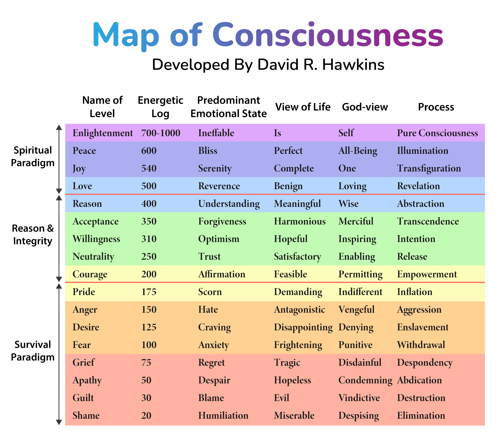

There’s a brutal honesty in admitting exactly where you stand. Most people can’t do it. They wrap themselves in delusions of progress, pretending to float in the realm of love and peace when, in reality, they’re clawing at survival, barely keeping their heads above water. But here’s the thing: survival isn’t failure. Survival is *mastery.* Anyone who hasn’t conquered the survival paradigm can’t hold their ground in higher ones. And if they were to fall? It would destroy them. 
The real question is: *what happens when survival becomes your comfort zone?*

I’ve spent a long time living in the survival paradigm—and I’m *good* at it. Anger, aggression, frustration. These aren’t just emotional states for me; they’re intensely useful sources of energy. They’ve carved me into someone who could thrive under any circumstances. A stone age mentality for a postmodern age. I know how to endure, how to fight, how to claw my way out, how to push through when everything else crumbles. But there’s a weight to that. A cost. And eventually, you realize that surviving isn’t the same as *living* and that we don't actually live in the stone age.

---

**The Map of Consciousness**

---

**The Illusion of Progress**

Let’s not kid ourselves. There’s a seductive lie baked into modern culture—that if you’re constantly grinding, constantly moving, you must be advancing. But motion isn’t progress. You can run in circles forever and call it a journey, but you won't have gotten very far. The survival paradigm tricks you into thinking that because you’re enduring, you’re evolving. But survival is static. It’s reactive, not proactive. It’s the refusal to die, not the decision to live. It's stubborn, not inspired.

I’ve broken into higher paradigms before. Seasons of love, moments of peace, flashes of joy. But they don’t last. Something about my energetic presence—my wiring, my history, my *essence*—pulls me back into the dirt. Back into the fight. And for a long time, I saw that as a defect. I'd ask myself: Why can’t I stay up there? Why can’t I live in the realms of reason, love, and peace? Why do I keep getting pulled down here?

But that’s the wrong question. The better question is: **What am I still learning down here?**

---

**The Strength in the Dirt**

The survival paradigm is where strength is forged. You can't forge it anywhere else. It’s the crucible where resilience, discipline, and willpower are beaten into shape. Most people spend their lives trying to avoid this space, numbing themselves with distractions, comforts, and lies. But if you’ve lived here—truly lived here—you know how sacred this space is. You know the kind of intensity that gets cultivated down here, the clarity that comes from being stripped of excess.

But survival, unchecked, becomes stagnation and stagnation is just one level above death. The survival paradigm rewards you for staying the same. It tells you that anger is productive, that aggression gets results, that discipline is enough. And for the most part, they *do* get results, and they *are* enough. But they're not everything. That same fire that fuels your progress prevents you from embodying higher states of consciousness. The anger that keeps you moving binds you to the survival paradigm.

This acknowledgement of the limitations of survival is where the real discomfort begins.

---

**The Fear of Ascent**

Moving up the consciousness stack isn’t just difficult—it’s fraught with risk. It means letting go of the tools that’ve kept you alive. The tools that have caused you to thrive. Anger is familiar. Pride is comfortable. Even fear has its place—it sharpens your instincts, keeps you alert. But Acceptance? Love? Joy? Those emotions don’t come with armor. They leave you exposed. Embodying them forces you to risk falling down the stack. Again. As you have a thousand times before.

And that’s the paradox. You’ve mastered survival. But survival isn’t the endgame. You know that. You have the map. You see the higher paradigms, and you’ve tasted them. But knowing where you want to go doesn’t make the journey any less daunting. It just means you’re aware of how far you still have to climb and of the risks involved with climbing higher.

---

**Patience is Necessary**

Here’s what I’ve learned: you can’t force your way up the stack. You can’t grit your way into love or reason the same way you grit through a workout or a tough day. The tools that served you in survival don’t translate directly to the spiritual paradigm. But that doesn’t mean they're useless. It just means the game is different.

Patience isn’t passive. It’s necessary. It’s the willingness to sit in the discomfort, to acknowledge exactly where you are without flinching. It’s the refusal to lie to yourself about your progress, even when the truth hurts. And that’s where I am right now. I’m in the survival paradigm. Not higher on the stack. Just here. And that’s fine.

Because I trust the process. I trust that the work I’m doing—the discipline, the introspection, the relentless pursuit of meaning—isn’t wasted. It’s all part of the alchemy. Maybe my alchemy isn’t good enough *yet*, but that doesn’t mean it won’t be. I have the map. I know where I want to go. And I’ll get there.

---

**The Cost of Honesty**

Being honest about where you are carries its own weight. It’s easier to pretend you’re further along, to craft a narrative of growth and enlightenment that keeps you feeling safe. But safety isn’t the goal. **Truth is.**

And the truth is, I’m still in the dirt. Still navigating the survival paradigm with all its anger, pride, and desire. But that doesn’t diminish the work I’m doing. It *grounds* it. It gives it context. Because when I do rise—and I will—it won’t be by accident. It won’t be a fleeting season of clarity. It will be earned. And it will be lasting.

---

**Integration, Not Escape**

Here’s the final thought—the one that’s been circling in my mind. **The goal isn’t to escape the survival paradigm.** It’s to *integrate* it. To take the lessons, the strength, the fire, and carry them into the higher states of consciousness in such a way that your presence in those higher realms can be sustained. You don’t abandon your survival skills when you ascend. You *elevate* them. You wield them differently.

Because even in love, in reason, in peace—there will be moments when survival instincts serve you. The difference is, you won’t be *defined* by them. You’ll be *informed* by them. The anger won’t control you, but it will remind you of what you’ve overcome. The pride won’t inflate you, but it will anchor you in the knowledge of your worth.

You don’t have to reject where you’ve been to move forward. You just have to be honest about it.

So here I am. In the dirt. But with my eyes on the horizon. And when the time comes to rise, I’ll be ready.

Until then, I’ll keep doing the work. Because the survival paradigm isn’t a prison. It’s a forge. And I’m not done being forged quite yet.